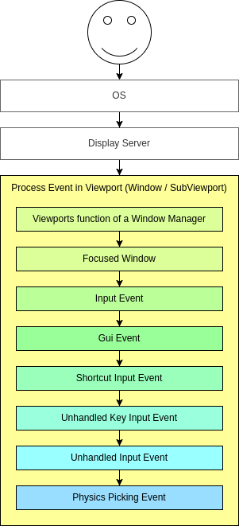
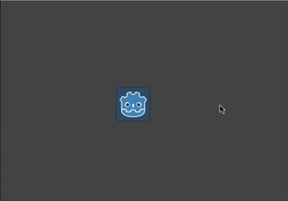

# 信号与输入
从本课开始，我们使用godot引擎4.3版本
## 输入
大部分输入操作都可以通过`Input`单例来完成，不过`Input`单例一般用于判断是否按下某个按键，而无法判断键盘上什么按键被按下了，而`_input(event)`和`_unhandled_input(event)`两个系统内置函数可以判断整个键盘上有什么被按下，并存储到`event`变量中
### `Input`单例
Input 是处理键盘按键、鼠标按钮及移动、游戏手柄、输入动作等的单例。
#### 输入映射
可以理解为给各种输入“取一个名字”
#### 各种方法
见[文档](https://docs.godotengine.org/zh-cn/4.x/classes/class_input.html#class-input-method-is-action-just-pressed)
#### 应用
一般我们会在`_physics_process(delta)`函数中调用`Input`单例来检测每一帧中是否有按键被按下，如果是跳跃这类“一次性”动作使用`is_action_just_pressed()`方法，如果是行走这种持续的动作使用`is_action_pressed()`方法，在之后讲解`CharacterBody2D`节点的时候会再提。
```gdscript
func _physics_process(delta):
    if Input.is_action_pressed("ui_right"):
    position.x += 0.1
```
### `_unhandled_input(event)`和`_input(event)`
这两个引擎自带函数在有输入（键盘、鼠标等）时自动触发。与`Input`单例比较大的差别是，不太适合处理持续的按键输入。
#### 区别

GUI:Graphical User Interface，即用户图形界面，在godot中代表GUI的节点是Control节点的子类。我们玩游戏时按`esc`键出现的菜单，开始游戏时选择存档的菜单等等都是GUI
对于游戏输入，_unhandled_input() 通常更合适，因为这个函数能够让 GUI 拦截事件。
#### `InputEvent`类型
上述两个函数中的`event`参数即为`InputEvent`类型，这种类型有很多子类，比如`InputEventKey`和`InputEventMouseButton`
#### 应用
```gdscript
func _unhandled_input(event):
	if event is InputEventKey:
		if event.pressed and event.keycode == KEY_ESCAPE:
			get_tree().quit()
```
`InputEventKey`[文档](https://docs.godotengine.org/zh-cn/4.x/classes/class_inputeventkey.html)
键的名称可以在[文档](https://docs.godotengine.org/zh-cn/4.x/classes/class_%40globalscope.html#enum-globalscope-key)中查到
## 信号
信号是节点在发生特定事件时发出的消息，例如按下按钮。其他节点可以连接到该信号，并在事件发生时调用对应的函数。
使用信号可以限制耦合，并保持代码的灵活性。
### 使用编辑器连接信号
### 用代码连接信号
也可以通过代码连接信号，在发射或接收信号方有一方在刚开始没有被加入到场景树，而是后来被实例化的情况下，只能使用这种方法。
`sprite_2d.gd`
```gdscript
func _ready():
    var button = get_node("../Button")
    button.pressed.connect(_on_button_pressed)

func _on_button_pressed:
    position.x += 1
```
### 自定义信号
例如，假设你希望在玩家的生命值为零时通过屏幕显示游戏结束。为此，当他们的生命值达到 0 时，你可以定义一个名为“died”或“health_depleted”的信号。
```gdscript
extends Node2D

signal health_depleted

var health = 10

func take_damage(amount):
	health -= amount
	if health <= 0:
		health_depleted.emit()
```
信号还可以选择声明一个或多个参数。
```gdscript
extends Node2D

signal health_changed(old_value, new_value)

var health = 10

func take_damage(amount):
	var old_health = health
	health -= amount
	health_changed.emit(old_health, health)
```
### 综合举例：信号如何影响代码耦合性
假设我们要做一个简单的射击小游戏
子弹肯定不能做中间"Player"的子节点，否则子弹和"Player"就是一体的

但是我们想要的效果是子弹一旦形成就不受鼠标方向的影响，应该将子弹作为主游戏场景的子节点添加，后者是"Player"的父节点
那么如果我们想通过获取父节点，再添加子节点的方式来完成子弹的添加的话
```gdscript
var bullet_instance = Bullet.instantiate()
get_parent().add_child(bullet_instance)
```
这将导致一个不同的问题. 现在, 如果你试图独立测试你的 "Player" 场景, 它将在射击时崩溃, 因为没有父节点可以访问，这使得独立测试你的游戏角色代码变得更加困难。
解决这个问题的方法是使用一个信号来 "发射" "Player"的子弹.
`player.gd`
```gdscript
extends Sprite2D

signal shoot(bullet, direction, location)

var Bullet = preload("res://bullet.tscn")


# func _input(event):
# 	if event is InputEventMouseButton:
# 		if event.button_index == MOUSE_BUTTON_LEFT and event.pressed:
# 			shoot.emit(Bullet, rotation, position)

func _process(delta):
	if Input.is_action_just_pressed("ui_accept"):
		shoot.emit(Bullet, rotation, position)
	look_at(get_global_mouse_position())
```
`main.gd`
```gdscript
extends Node2D

func _on_player_shoot(Bullet, direction, location):
	var spawned_bullet = Bullet.instantiate()
	add_child(spawned_bullet)
	spawned_bullet.rotation = direction
	spawned_bullet.position = location
	spawned_bullet.velocity = spawned_bullet.velocity.rotated(direction)
```
`bullet.gd`
```gdscript
extends CharacterBody2D

func _ready() -> void:
	velocity = Vector2(1000,0)

func _physics_process(delta):
	move_and_slide()
```