# 绪论
## Godot引擎的命名和发音
Godot引擎的名称应该总是以标题的形式出现。另外，Godot应该只有一个大写字母——它不是“GoDot”。（有个创始人都这么读）
戈多是以《等待戈多》(Waiting for Godot)这出戏的名字命名的，通常发音就像在剧中一样。不同的语言对Godot有不同的发音，我们觉得它很美。
对于母语是英语的人，Godot游戏引擎Godot读音为“GOD-oh”;"t"不发音（GO音调高D-oh音调低），就像《等待戈多》(Waiting for Godot)法语原版一样。
## 什么是游戏引擎
实际上，只靠一门编程语言也可以写出一个游戏。但是如果没有游戏引擎，那么一些游戏的共性模块，如物理模块，角色移动模块，光影模块等等每次都要全部重写
开发者意识到他们不必再从零开始为不同的游戏编写代码，而是可以将描述游戏共性的代码多次利用，形成某类游戏的开发工具，这也就是我们常说的游戏引擎。而游戏引擎的出现，则大大简化了游戏程序开发的流程，也大幅度降低了游戏开发的难度。
## 游戏引擎的优点
1. 具有可操作图形界面，可以直观地改动一些数据（而不是在一大堆代码里修改）
2. 内置一些共性模块的代码，避免重复劳动
## 流行游戏引擎
### 虚幻四、五(Unreal Engine)
虚幻四：PUBG，和平精英，实况足球2022
虚幻五：黑神话悟空
优点：最有优势的特点是视觉质量，在渲染3A质量的图形方面具有更好的性能。
缺点：
1. 主要用于开发3D游戏，对2D游戏开发不友好。
2. 非常大。虚幻五50G左右。
3. 对电脑配置要求相对较高
### Unity
全平台（包括PC/主机/移动设备）所有游戏中有超过一半都是使用Unity创作的
代表作：明日方舟，崩坏3，原神，王者荣耀等
仅有的几个缺点
1. 引擎维护、开发者不干人事，与用户需求割裂
2. 因为过于成熟和商业化，导致其变的臃肿。对电脑配置要求相对较高。
### Why godot?
代表作：恶魔轮盘，土豆兄弟
优点：
1. 引擎本体超级小，对开发端和用户端的电脑配置要求低

2. 适合制作2D小体量游戏。
3. **开源**

缺点：
1. 中文教程少
2. 3D难用
对于小体量2D独立游戏的开发，godot是个不错的选择。
## 环境配置
### godot下载以及导出模板安装
[godot官网](https://godotengine.org/)（需要科学上网）
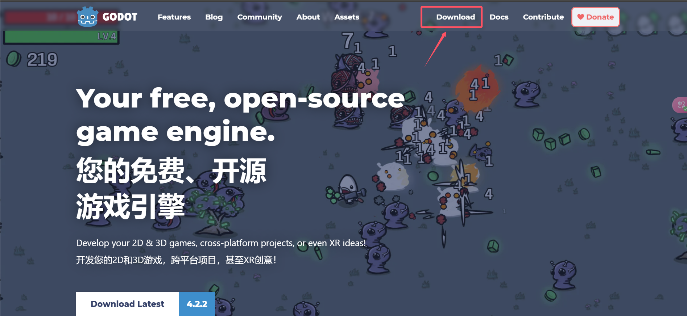
点download之后往下翻
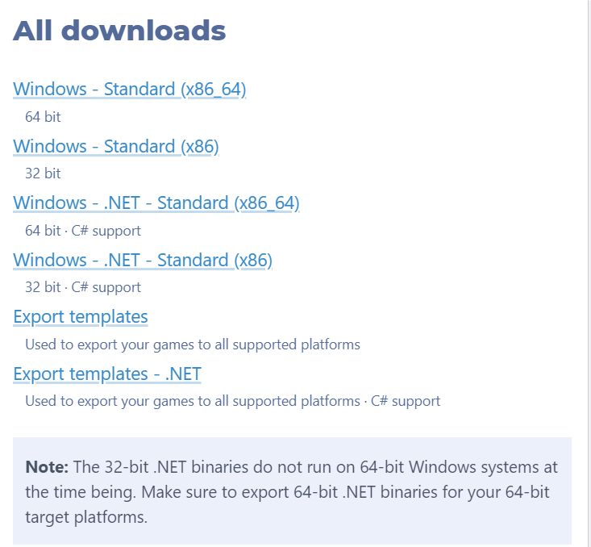
#### 64位系统
初学者选第一个和第五个下载就好
如果有C#语言基础的可以下载第三个和第六个
本课程使用GDScript作为编程语言，按初学者的选择就够用了
#### 32位系统
初学者对应第二个和第五个
有C#语言基础对应第四个和第六个
（现在基本没有32位系统了吧）

打开godot，随便新建一个项目，点击项目-导出
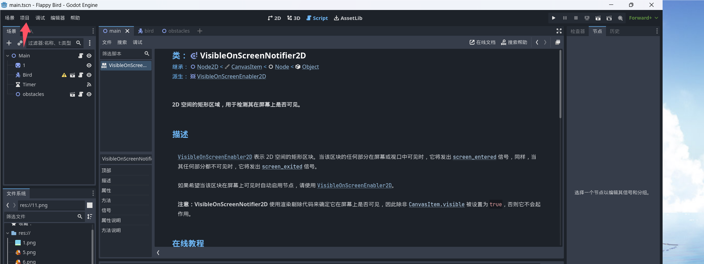
点击添加-Windows Desktop
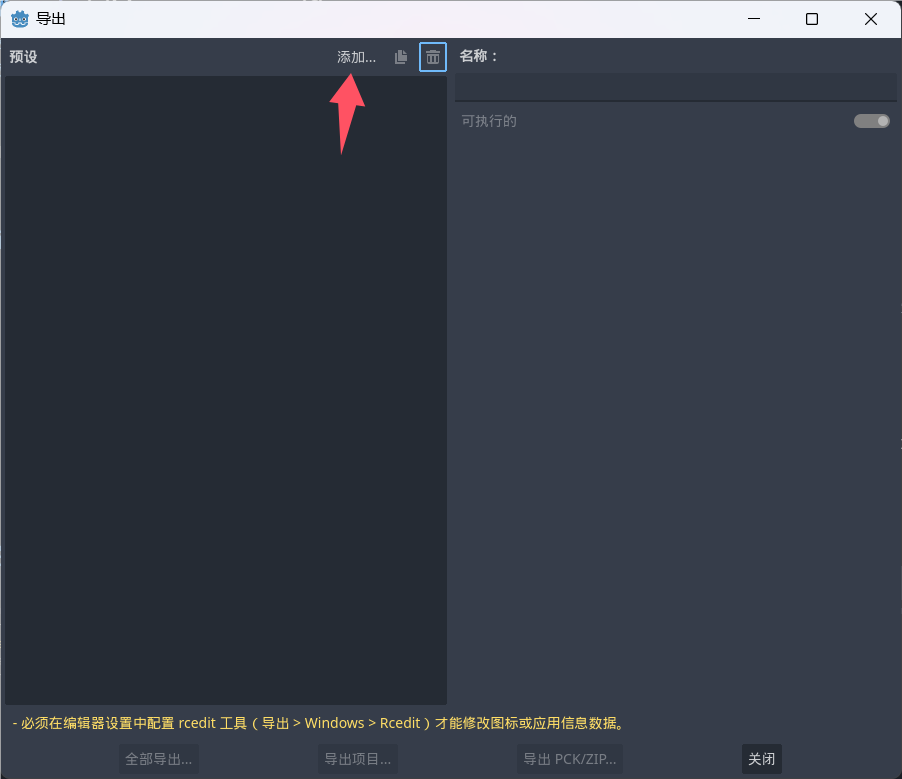
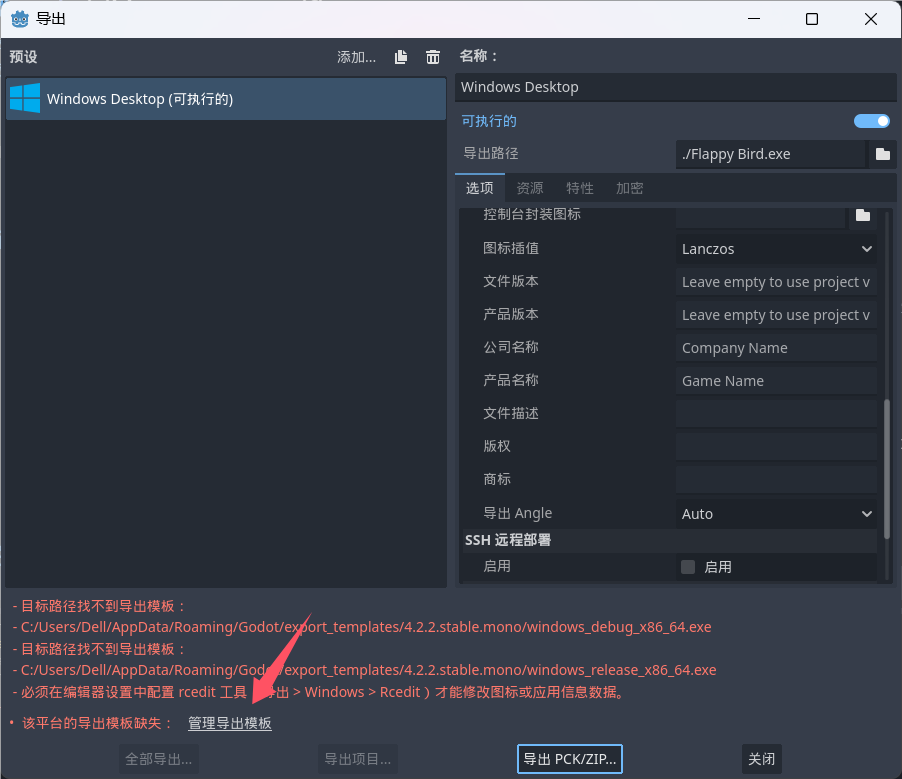
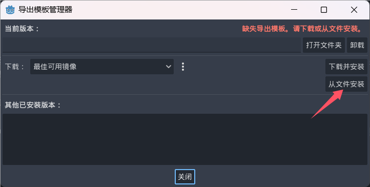
选择刚才下载的export templates即可。
### （选做）外联vscode编辑器
vscode是一个轻量级功能强大的源代码编辑器，支持语法高亮、代码自动补全、代码重构、查看定义功能，并且内置了命令行工具和 Git 版本控制系统。
[vscode官网](https://code.visualstudio.com/download)
打开vscode后点扩展（插件）
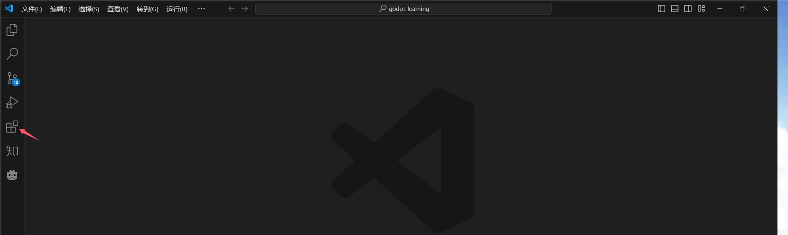
在插件的搜索栏中搜索Chinese，安装第一个，安装完会提示重启程序，重启即可，界面会变为中文。
然后再次点击扩展页面，搜索godot，安装godot-tools
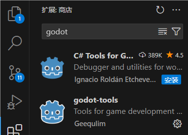
安装完成后选中godot-tools，选择设置
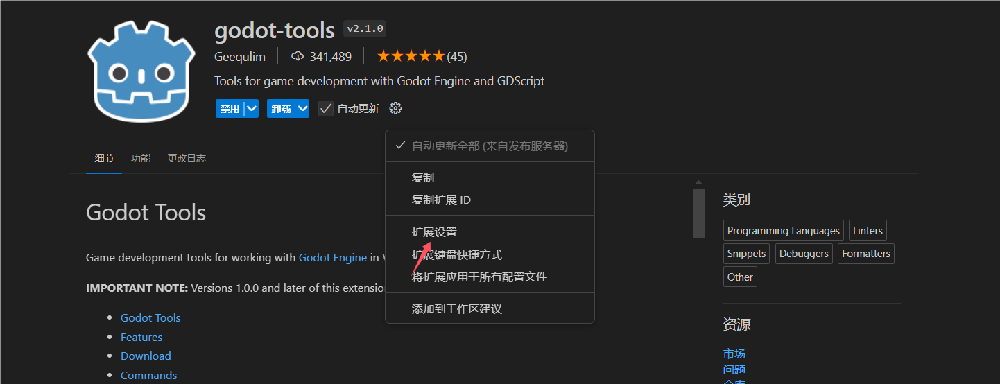
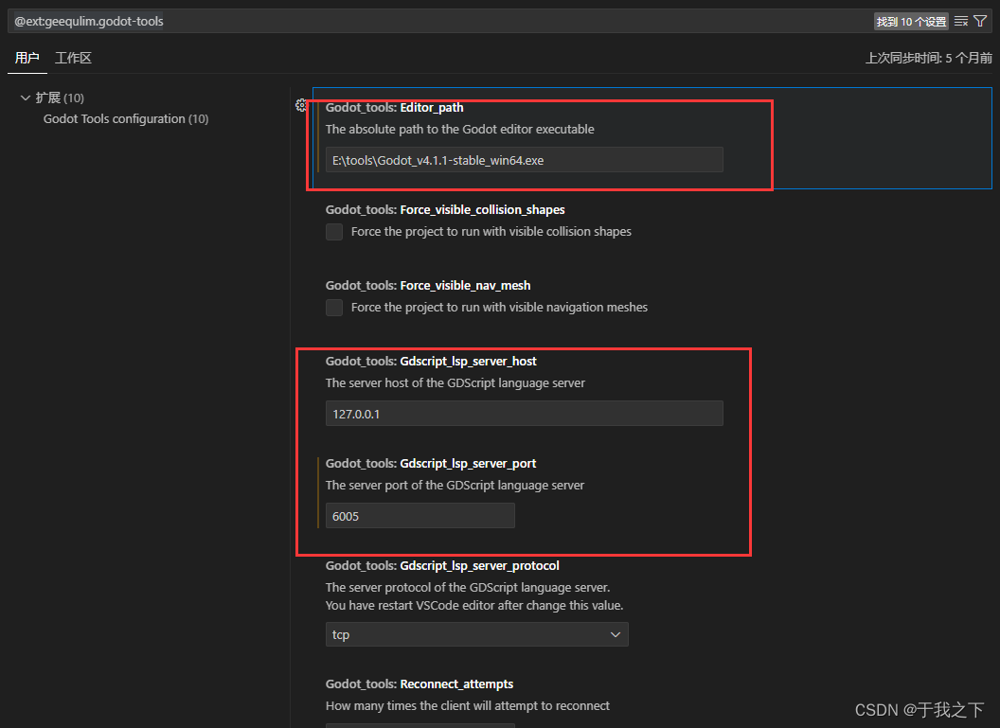
Editor_path: 你的godot引擎的exe路径

GDscript_lsp_server_host: godot引擎语言服务器ip

GDscript_lsp_server_host: godot引擎语言服务器端口号

注意：语言服务器设置这里要跟Godot编辑器的设置对应上。对应的godot编辑器的设置：

编辑器-> 编辑器设置 -> 网络 -> 语言服务器 -> 远程主机、远程端口
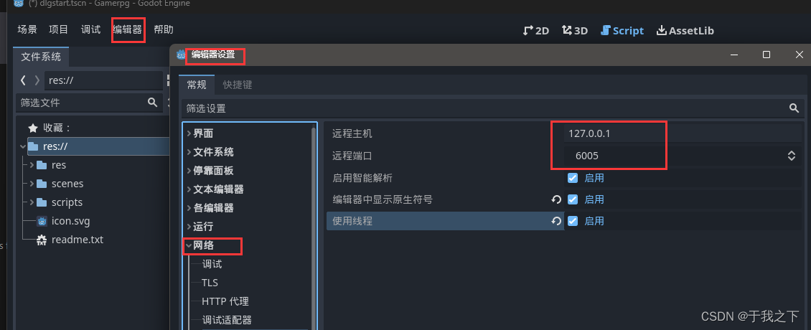
最后我们对godot编辑器本身进行设置
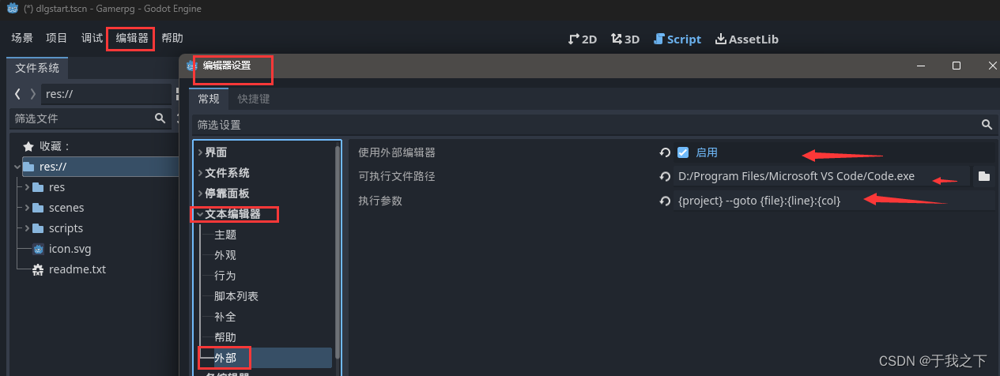
编辑器-> 编辑器设置->文本编辑器->外部

使用外部编辑器：√

可执行文件路径：vscode可执行exe的路径

执行参数：{project} --goto {file}:{line}:{col}